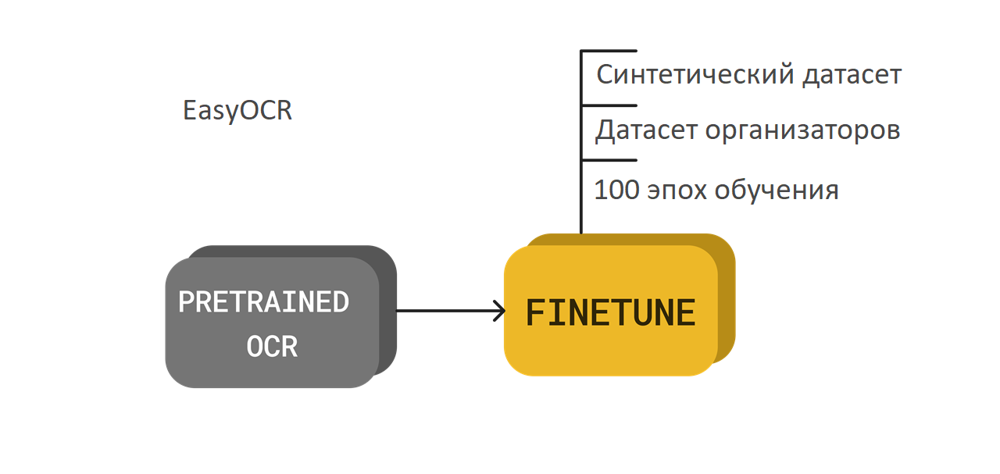

<p align="center">
      <br/>
    <H2 align="center">Кейс: Оценка маркировки и маркетинга продуктов детского питания</H2> 
</p>

> В последние годы продажи продуктов детского питания стремительно растут, и рынок европейских стран, включая Россию, является одним из крупнейших в мире. Вместе с тем нарастает обеспокоенность, что ненадлежащее продвижение продуктов питания для детей грудного и раннего возраста может препятствовать оптимальному питанию и здоровью детей этой возрастной группы.

>Разработанное участниками решение позволит определить распространенность декларирования информации о пищевой ценности и маркировки пищевой продукции детского питания. Решение указанной задачи исследователями в «ручном» режиме осложняется временным и «человеческим» факторами, связанными с полнотой и качеством сбора данных, что приводит к возникновению неточностей и ошибок. 


# Описание решения
**За основу решения ML части были выбраны модели:**
* YoloV8 Large (Обнаружение областей с полезной информацией на этикетке продукта)

* Пример распознанного изображения
  


* EasyOCR (Оптическое распознавание символов)


# Описание работы пайплайна
- Пользователь загружает фото продукта на сайт.
- Обработка изображения с помощью YOLOv8l:
    - Мы используем алгоритм YOLOv8l для обнаружения областей с полезной информацией на этикетке продукта. Это позволяет выделить текстовые зоны, которые нам нужно распознать.
- Распознавание текста с помощью EasyOCR:
    - EasyOCR выполняет распознавание текста на этикетке. Полученные результаты содержат информацию о продукте, но могут содержать ошибки.
- Коррекция текста с использованием алгоритма Левенштейна:
    - Чтобы улучшить точность распознавания, мы применяем алгоритм Левенштейна для исправления ошибок в распознанном тексте.
- Извлечение информации о маркировке с помощью регулярных выражений:
    - Мы используем регулярные выражения для поиска ключевых слов и фраз, связанных с маркировкой продукта. Это может включать в себя информацию о составе, сроке годности, производителе и другие детали.
- Выдача рекомендаций пользователю:
    - На основе обработанных данных мы предоставляем пользователю рекомендации, связанные с продуктом.


# Развертка

Для запуска на локальном хосте:
Скачайте репозиторий на свой компьютер 
```
git clone https://github.com/
```
откройте проект в вашем IDE, например в Visual Studio code
Запустите виртуальное окружение, введите следующие команды через терминал(Windows):
```
python -m venv venv
venv/Scripts/activate
```
Установите все зависимости
```
pip install -r requirements.txt
```
Если хотите запустить решение на GPU с использованием CUDA для Windows вам может потребоваться установить pytorch вручную. Пожалуйста, следуйте инструкциям с веб-сайта <a href="https://pytorch.org/">pytorch</a>.

Установите обученную модель easyocr(путь по умолчанию `~/.EasyOCR/`)
```
move custom_example.py ~/.EasyOCR/user_network
move custom_example.yaml ~/.EasyOCR/user_network
move custom_example.pth ~/.EasyOCR/model
```
Запустите локальный сервер Django
```commandline
python.exe .\manage.py runserver
```

# Демонстрация работы решения

Ознакомиться с подробным роликом тестирования демонстрационного приложения можно по ссылке: *https://disk.yandex.ru/d/KlPmSKBdl2CPIg*

<p align="right">(<a href="#readme-top"><i>Вернуться наверх</i></a>)</p>
